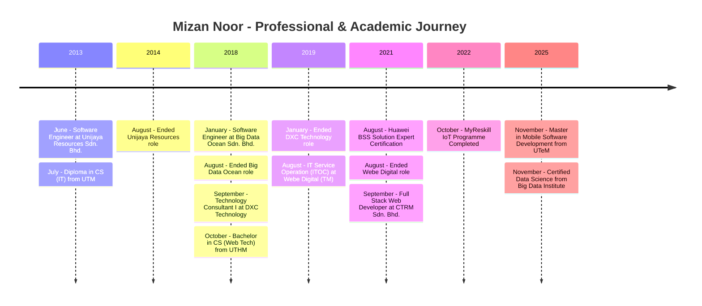

# Hi, I'm Mizannoor! 👋

Welcome to my GitHub profile.

## 🚀 About Me
I'm a **Senior Full Stack Polyglot Developer** with over **11 years of experience** in software engineering, DevOps, and Microservices architecture. My journey in technology is fueled by a deep passion for the JavaScript ecosystem, modern architecture patterns, and the endless possibilities of cloud computing. Recently, I advanced my technical expertise with a **Master's in Mobile Software Development** and a **Data Science Certification**.

## 🏆 Achievements
- **Certified Data Science** | Big Data Institute
- **Master in Mobile Software Development** | UTeM
- **Huawei BSS Solution Expert**
- **MYRESKILL IoT Program by MPC Graduate**

## 💻 Top Skills
- Full Stack Development (React, Node.js, Laravel)
- DevOps & Automation
- AI/ML Integration & Data Science
- Mobile App Development

## 📈 Professional Journey

## 🌟 Featured Projects
- [hvac-insight-kotlin-app](https://github.com/mizannoor/hvac-insight-kotlin-app) – Smart HVAC insights powered by Kotlin and IoT.
- [snapdash-cms](https://github.com/mizannoor/snapdash-cms) – Flexible content management platform.

## ⚡ Interests
- Hiking sports ⛰️
- Smart Gadgets & IoT
- Web & AI/ML Tech

## 🔗 Connect With Me
- [Website/Resume](https://mizannoor.github.io/)
- [LinkedIn](https://www.linkedin.com/in/mizannoor/)
- [GitHub](https://mizannoor.github.io/)

---

*Thanks for visiting my profile! Feel free to explore my projects and connect with me.*
